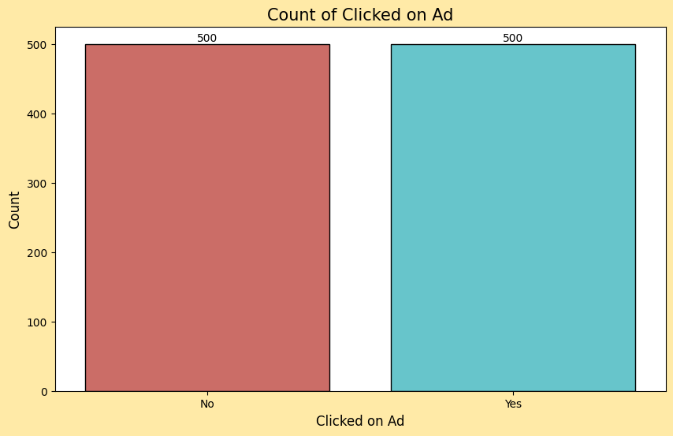
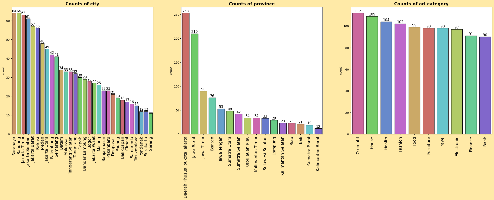
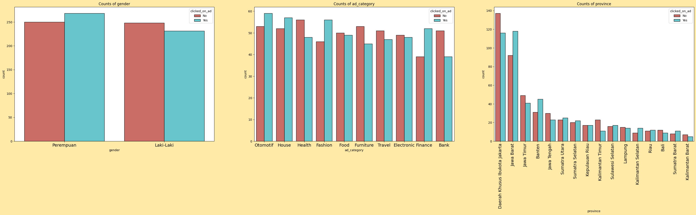
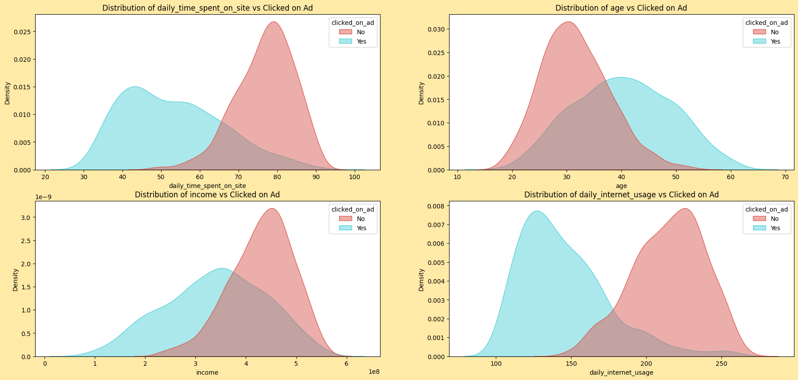
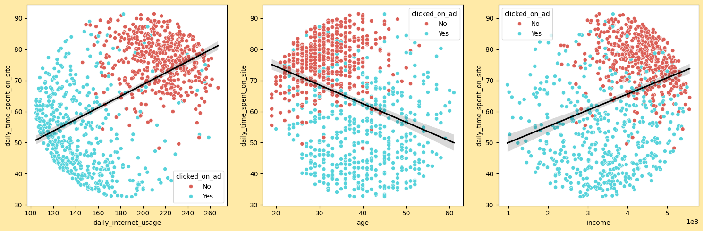
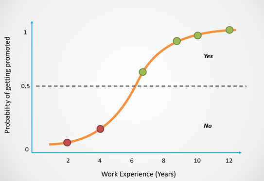
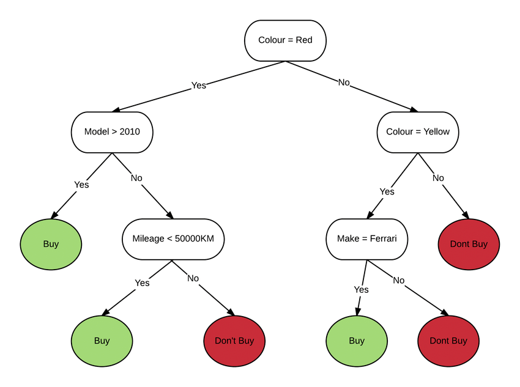
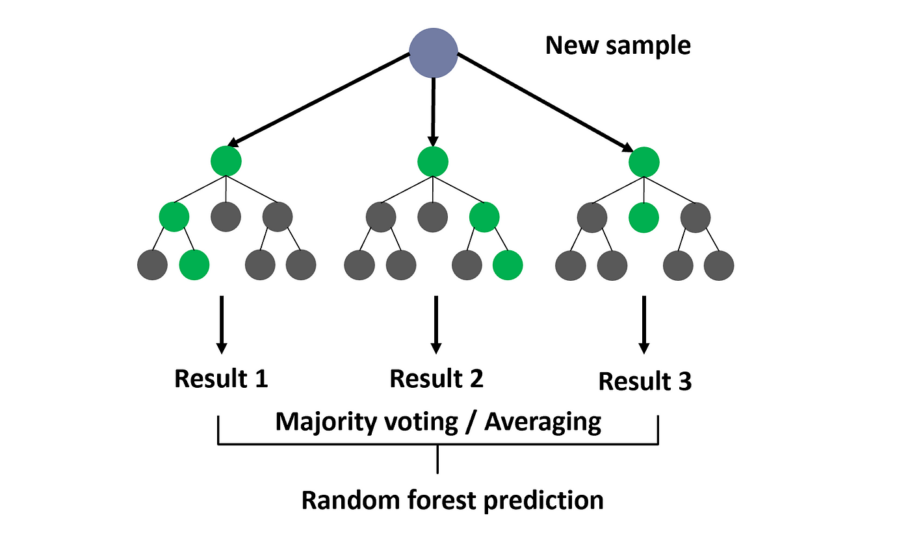
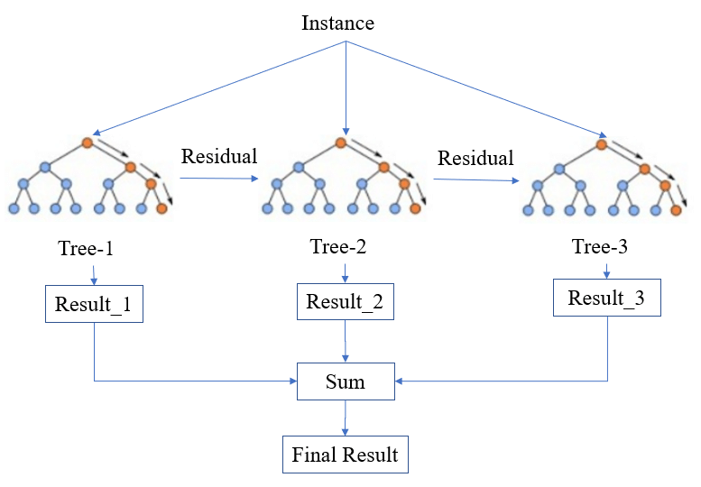

<p align="center">
  <a href="#">
    
    
    
    
    
    
    
    
    
  </a>
</p>

#  Mini Project 4: Predict Customer Clicked Ads Classification 


Photo by [Anthony Rosset](https://unsplash.com/@anthonyrosset?utm_content=creditCopyText&utm_medium=referral&utm_source=unsplash) on [Unsplash](https://unsplash.com/photos/group-of-people-walking-near-high-rise-buildings-5r5554u-mHo?utm_content=creditCopyText&utm_medium=referral&utm_source=unsplash)

  
## Table of Contents
1. [Background Project](#Bacgkrpund-Project)
2. [Scope of Work](#Scope-of-Work)
3. [Data and Assumptions](#Data-and-Assumptions)
4. [Data Analysis](#Data-Analysis)
5. [Data Preprocessing](#Data-Preprocessing)
5. [Modelling and Evaluation](#Modelling-and-Evaluation)
6. [Conclusion](#Conclusion)
7. [Suggestions](#Suggestions)
8. [Installation and Usage](#Installation-and-Usage)

## Background Project
### What is the problem to solve?
The problem is the company wants to **target the right customers who are more likely to click on the ads** so the **company don't waste their money** on giving advertisements to the wrong customers.

### Why is this problem important?
This problem is important **because the company can save a lot of money by targeting the right customers** who are more likely to click on the ads. This will help the company to increase their profit.

### What is the goal of this project?
The goal of this project is to **increase the conversion rate** of the company and also **will help the company to increase their profit**.

### What Will be Changed if There are the Model Results?
If there are the model results, the company will **target the right customers who are more likely to click on the ads** so the company **don't waste their money** on giving advertisements to the wrong customers.

## Scope of Work
### What is the scope of this project?
The scope of this project is to **predict the customers who are more likely to click on the ads** so the company can **target the right customers**.

### How is the output of the developed model?
The output of the developed model is the classification prediction of the customers who are more likely to click on the ads and not.

## Data and Assumptions
### Data Size
The data size is 1000 rows and 11 columns.

### Features and Description
Features | Description
--- | ---
`Unnamed: 0` | This is an index column.
`daily_time_spent_on_site` | This is a numerical field that represents the amount of time a customer spends on the site daily. It's measured in minutes. 
`age` | This is a numerical field that represents the age of the customer.
`area_income` | This is a numerical field that represents the income of the area where the user lives. It's measured in Indonesian Rupiah.
`daily_internet_usage` | This is a numerical field that represents the amount of time a user spends on the internet daily. It's measured in minutes.
`gender` | This is a categorical field that represents the gender of the user. It's in Indonesian, with "Perempuan" meaning female and "Laki-Laki" meaning male.
`timestamp` | This is a datetime field that represents when the user clicked on the ad. It's in the format of month/day/year hour:minute.
`clicked_on_ad` | This is a categorical field that represents whether the user clicked on the ad. "No" means the user did not click on the ad.
`city` | This is a categorical field that represents the city where the user lives.
`province` | This is a categorical field that represents the province where the user lives.
`ad_category` | This is a categorical field that represents the category of the ad.

### Assumptions
Based on my domain knowledge, I assume that the feature that will be useful for predicting whether the customer will click on the ads or not are:
- `daily_time_spent_on_site`
- `age`
- `area_income` / `income`
- `daily_internet_usage`
- `city`
- `province`
- `ad_category`

The rest of the features are not useful for this prediction task, especially timestamp feature this feature is indicated as data leakage because this feature generated right aftert the target feature `clicked_on_ad` generated.

### Data Analysis

#### How many customers clicked on the ads and not?

There's 500 customers who clicked on the ad and 500 others didn't, in other words the target feature `clicked_on_ad` is balanced, so there's no need to do any resampling technique later.

#### Where the customer come from and what ad category is prefered?

- The customer come from 30 different cities and 16 different provinces. The top 3 Cities where the customer come from are Surabaya, Bandung, and Jakarta Timur, and The top 3 Provinces where the customer come from are DKI Jakarta, Jawa Barat, and Jawa Timur 

- Seems like there's no significant different of the ad category that the customer clicked on.  

#### Customer Type & Behaviour Analysis on Advertisement
##### Customer Type distribution analysis different by target

- Female customers are slightly more likely to click on ad compared to Male customers.
- Automotive, House, Fashion, and Finance ad category are more likely to be clicked by the customer compared to the other ad category.
- Customer from Province DKI Jakarta are less likely to click on an compared to Jawa Barat (compared only the top province) 

##### Customer behavior distribution analysis different by target

From the distribution above, we can see that:
- The density distribution of the customer who clicked on the ads and not, is seperated by the daily time spent on the site. This mean the customer who clicked on the ads spent less time on the site compared to the customer who didn't click on the ads.

- For the density distribution of the customer who clicked on the ads and not, is seperated by the daily internet usage. This mean the customer who clicked on the ads spent less time on the internet compared to the customer who didn't click on the ads. these 2 insights are connected because the less the customer use internet the less time they spend on the site.

- Age and income distribution for the customer who clicked on the ads and not are not very well separated.

#### Customer behavior correlation analysis different by target 

- `daily_internet_usage` and `daily_time_spent_on_site` are positively correlated with each other, and the customer who clicked on the ads spent less time on the site and less time on the internet compared to the customer who didn't click on the ads.

- `daily_time_spent_on_site` and `age` are negatively correlated with each other, and the customer who clicked on the ads are older compared to the customer who didn't click on the ads. 

- `daily_time_spent_on_site` and `income` are weak positively correlated with each other, and the customer who clicked on the ads have slightly lower income compared to the customer who didn't click on the ads.

### Data Preprocessing
#### Handling Missing Values

````python
Missing Data Percentage:

daily_time_spent_on_site    1.30%
income                      1.30%
daily_internet_usage        1.10%
gender                      0.30%
dtype: object
````

Even though the missing percentage is not too high, I decided to fill the missing values to not lose any infomation, I fill the missing values on numerical data with median (since the numerical data distribution are skewed) and for data categorical filled with mode.

#### Feature Engineering 
- I create a new feature `age_group` to group the age into 4 groups: `Young`, `Adult`, `Middle Age`, and `Old`.

- Bin Province into more general value : `Jawa`, `Sumatera`, `Kalimantan`, `Riau`, etc.

- Extract the month, day, and hour from the timestamp feature.

#### Feature Selection
Feature selection based on Chi-Square test and ANOVA test, the selected features are:
- `daily_time_spent_on_site`
- `age_group`
- `income`
- `daily_internet_usage`
- `province`

#### Feature Encoding
- Encode Target Feature `clicked_on_ad` with Label Encoding.
- For the `age_group` feature, I use ordinal encoding because the age group has an order.
- For the `province` feature, I use One Hot Encoding because the province has no order.

#### Data Splitting
I split the data into 70% training data and 30% testing data.
(scaling not performed yet because I want to test the model performance without scaling the data)

### Modelling and Evaluation
#### Model Selection
The mode that I used for this classification task are:
- Logistic Regression<br> This is a simple model that is easy to interpret and understand, this model also performs well when the data can be linearly seperated like our data. It's also good when we have a binary classification task and the input variables are independent of each other.


Image Source: [Natassha Selvaraj](https://www.natasshaselvaraj.com/logistic-regression-explained-in-7-minutes/)

- Decision Tree<br> Decision Trees are great for data thta has a mix of categorical and numerical features, making them versatile.


Image Source: [EdrawMax](https://www.edrawmax.com/decision-tree/)

- Random Forest<br> Random Forests are less likely to overfit than individual decision trees and often provide better accuracy. This is an ensemble method that combines multiple decision trees to improve the model's performance.


Image Source: Dr. Roi Yehoshua on [Medium](https://medium.com/@roiyeho/random-forests-98892261dc49)

- XGBoost<br> XGBoost is a powerful model that can handle a variety of data types and structures. It's particularly good at dealing with imbalanced datasets due to its built-in capability to handle class imbalance. Even though our data is not imbalance and we don't really need very complex model, but I want to test and see how the model perform.


Image Source: [Research Gate](https://www.researchgate.net/figure/Simplified-structure-of-XGBoost_fig2_348025909)

#### Metrics Evaluation
Metrics evaluation used for this project are:
- Precision Score<br> Precision measures the proportion of true positive predictions (customers who clicked on the ad and were correctly identified) among all positive predictions. A high precision means that when our model predicts a customer will click on the ad, it is likely to be correct.

- ROC-AUC Score<br> The Receiver Operating Characteristic (ROC) curve is a plot that shows the prformance of a binary classification model as the discrimination threshold is varied. A higher AUC-ROC indicates a better performing model.

#### Model Evaluation

